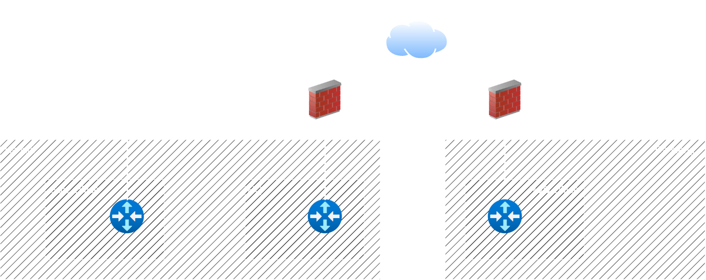
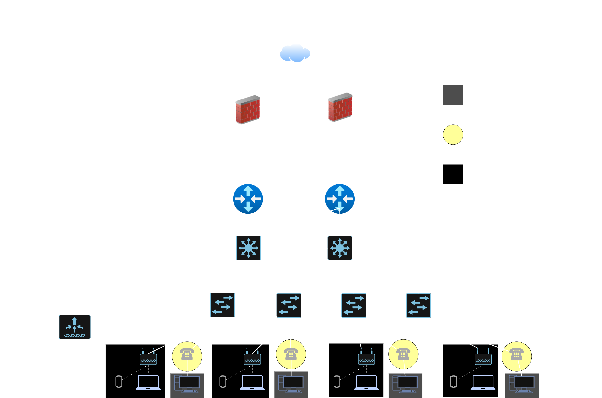
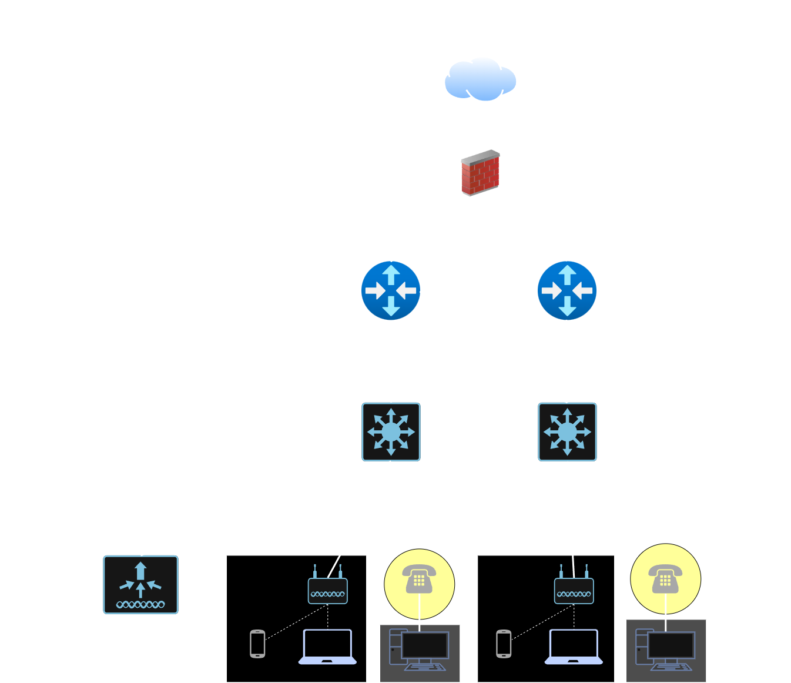
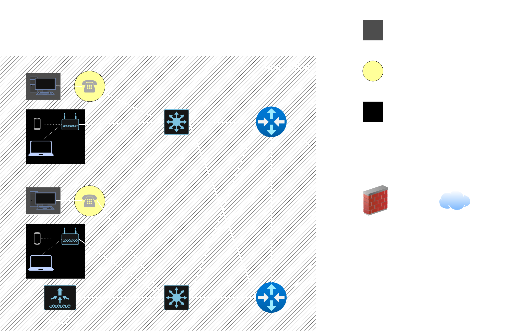

# Design a Multi Site Network

---

## 1. Introduction

This document presents a proposal for the design and implementation of a network infrastructure for CMC Holding, meeting the requirements of connection, performance, security and expansion ability for three operating locations of the company in Hà Nội and Đà Nẵng. The objective is to build a stable, safe and effective network, supporting the business and development of the company.

## 2. Scenario Overview

CMC Holdings is a mid-size company with about 600 employees, working in 3 locations:

- **Headquarters (HQ)**: 10 floors, Hà Nội. There are about 300 employees working here. 
- **R&D Office**: 5 floors, Đà Nẵng. There are about 200 employees working here.
- **Sales Office**: 3 floors, Hà Nội (about 3 km from HQ): There are 100 employees working here.

The requirements:

- Access the Internet at high speed and stability for all employees.
- Connect locally efficiently between all departments and locations.
- 3 Site can connect VPN to each other.
- High availability of all Internet services.
- Security data and system.
- Available for expanding in the future.
- Support both IPv4 and IPv6.

To view full requirement of network, visit [Scenario & Requirement](./Scenario_&_Requirements.md).

## 3. WAN Topology

As the scenario, the HQ and Sale Office are quite near so I just use a single mod fiber cable to connect between two site. R&D Office is so far, and while the requirement require VPN connection, so I will select VPN Site-to-site method. So 3 site can connect locally, their employee also can connect VPN into each site because of the firewall.

   
  <em>Image 1: WAN Topology</em>

## 4. Campus LAN Topology

### Some principles and deman analysis

Before designing the network topology for each sites, I want all the topologies agree with these principles:

- Each site will deploy redundant routers (2 routers per site), using OSPFv3 (Dual-stack) for routing protocol and FHRP (HSRPv2 in this project) for backup gateway. Feature enhancements such as Preemption and Interface/Object Tracking must be enabled to ensure seamless failover
- Each sites will be designed by Cisco architecture based on their specific scale and capacity:
    - HQ: 10 floors with 300 employees, so I will apply traditional 3-tier architecture (Core - Distribution - Access).
    - R&D and Sales Office: I will apply 2-tier architecture (Core/Distribution - Access) to balance performance and cost.
- Using RPVST+ technique for Switches to prevent loop and LCAP for load balancing.

Moreover, for this project, I will assume that each employee has 3 devices including phone, laptop and desktop. Beside that, there are printers, cameras, guest accesses and other deviceson each site to this is necessary for scaling the number. I also need to calculate other infrastructure devices like, voice phones, Access points or server hosts.

| Site | Number of Employees | Host Estimation |
| :--- | :--- | :--- |
| **HQ** | 300 employees | **900 - 1,000 IPs** |
| **R&D** | 200 employees | **600 - 700 IPs** |
| **Sales** | 100 employees | **300 - 400 IPs** |

### Headquaters

   
  <em>Image 2: HQ Network Topology</em>

### R&D Office

   
  <em>Image 3: R&D Network Topology</em>

### Sales Office

   
  <em>Image 4: Sales Network Topology</em>

For more about the whole network, visist [CMC Network Topology](./Assets/CMC_Network_Topology.drawio.png) or open [CMC_Network-Topology.pkt](./CMC_Network-Topology.pkt) in Cisco Packet Tracer.

## 5. IPs Subnetting

### IPv4 Plan

Based on the demand analysis above, I can calculate subnet for each site:

- **HQ**: Subnet `/22` (1.022 IPs available).
- **R&D Office**: Subnet `/22` (1.022 IPs available).
- **Sales Office**: Subent /`23` (510 IPs available).

To achieve saclable routing and efficient route summarization across the enterprise WAN, I select the private IPv4 calss B block `172.16.0.0/16`. So each sites has IPs:

- **HQ:** `172.16.0.0/22`.
- **R&D:** `172.16.4.0/22`.
- **Sales Office:** `172.16.8.0/23`.

Moreover, for link or tunnel, I will subnet `/30` (2 IPs available). For more detail, go to [IP Plan](./IPs_Plan.md).

### IPv6 Plan

Still based on demand analysis, and I assume that the ISP gave company subnet `/48`, so the network address is `2001:db8:aaa::/48`:

- **HQ**: `2001:db8:aaa:1::/52`.
- **R&D Office**: `2001:db8:aaa:2::/52`.
- **Sales Office**: `2001:db8:aaa:3/52`.

Once again, for more information, go to [IP Plan](./IPs_Plan.md).
